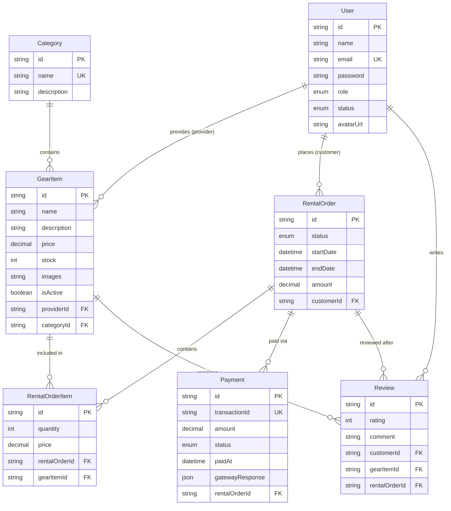

# GearUp 

## 📌 Project Overview

**GearUp** is a backend API for a sports and outdoor equipment rental service. Customers can browse available gear, place rental orders, and return equipment. Providers manage their gear inventory and fulfill rental orders. Admins oversee the platform, manage users, and moderate listings.

---

## 👥 Roles & Permissions

| Role | Key Capabilities |
|------|-----------------|
| **CUSTOMER** | Register, browse gear, place rentals, make payments, leave reviews |
| **PROVIDER** | Add/edit/delete gear inventory, view & update order status |
| **ADMIN** | Manage all users (activate/suspend), view all gear & rentals |

---

## Tech Stack

- **Runtime:** Node.js + TypeScript
- **Framework:** Express.js
- **ORM:** Prisma
- **Database:** PostgreSQL (Prisma Postgres)
- **Auth:** JWT (jsonwebtoken + bcrypt)
- **Validation:** Zod
- **Payment:** SSLCommerz
- **Deployment:** Vercel

---

## Features

### Public Features
- Browse all available sports & outdoor gear
- Search and filter by category, price, brand, and availability
- View gear details with specifications

### Customer Features
- Register and login as customer
- Place rental orders (select dates + items)
- **Make payments via Stripe or SSLCommerz when placing or confirming an order**
- **View payment history and payment status**
- Track rental order status
- Leave reviews after returning gear
- Manage profile

### Provider Features
- Register and login as provider
- Add, edit, and remove gear from inventory
- Manage stock and availability
- View incoming rental orders
- Update order status (confirm, mark picked up, mark returned)

### Admin Features
- View all users (customers and providers)
- Manage user status (suspend/activate)
- View all gear listings and rental orders
- Manage gear categories

---

## 📡 API Endpoints

**Base URL:** `https://gear-up-iota.vercel.app`

### Authentication
| Method | Endpoint | Auth | Description |
|--------|----------|------|-------------|
| POST | `/api/auth/register` | Public | Register new user (CUSTOMER or PROVIDER) |
| POST | `/api/auth/login` | Public | Login, returns JWT token |
| GET | `/api/auth/me` | Any | Get current user profile |
| PUT | `/api/auth/me` | Any | Update profile |
| PATCH | `/api/auth/change-password` | Any | Change password |

### Public Gear
| Method | Endpoint | Auth | Description |
|--------|----------|------|-------------|
| GET | `/api/gear` | Public | Get all gear (filter: category, minPrice, maxPrice, brand, search) |
| GET | `/api/gear/:id` | Public | Get single gear with reviews |
| GET | `/api/gear/:id/reviews` | Public | Get reviews for a gear item |
| GET | `/api/categories` | Public | Get all categories |

### Provider
| Method | Endpoint | Auth | Description |
|--------|----------|------|-------------|
| POST | `/api/provider/gear` | PROVIDER | Add gear to inventory |
| GET | `/api/provider/gear` | PROVIDER | Get own gear listings |
| PUT | `/api/provider/gear/:id` | PROVIDER | Update gear listing |
| DELETE | `/api/provider/gear/:id` | PROVIDER | Remove gear |
| GET | `/api/provider/orders` | PROVIDER | View incoming rental orders |
| PATCH | `/api/provider/orders/:id` | PROVIDER | Update order status |

### Rentals
| Method | Endpoint | Auth | Description |
|--------|----------|------|-------------|
| POST | `/api/rentals` | CUSTOMER | Create rental order (auto-calculates total by days) |
| GET | `/api/rentals` | Any | Get own rental orders |
| GET | `/api/rentals/:id` | Any | Get rental details |

### Payments (SSLCommerz)
| Method | Endpoint | Auth | Description |
|--------|----------|------|-------------|
| POST | `/api/payments/create` | CUSTOMER | Initiate SSLCommerz payment, returns gateway URL |
| POST | `/api/payments/confirm` | Public (webhook) | SSLCommerz callback — validates & confirms payment |
| GET | `/api/payments` | CUSTOMER | Payment history (paginated, filterable) |
| GET | `/api/payments/:paymentId` | CUSTOMER | Single payment details |

### Reviews
| Method | Endpoint | Auth | Description |
|--------|----------|------|-------------|
| POST | `/api/reviews` | CUSTOMER | Create review (only for RETURNED rentals) |

### Admin
| Method | Endpoint | Auth | Description |
|--------|----------|------|-------------|
| GET | `/api/admin/users` | ADMIN | Get all users |
| PATCH | `/api/admin/users/:id` | ADMIN | Activate / suspend user |
| GET | `/api/admin/gear` | ADMIN | Get all gear listings |
| GET | `/api/admin/rentals` | ADMIN | Get all rental orders |

---

## 🔐 Admin Credentials

| Field | Value |
|-------|-------|
| **Email** | admin@gearup.com |
| **Password** | admin123 |

---

## 🧑‍💼 All Test Credentials

| Role     | Email                  | Password      |
|----------|------------------------|---------------|
| Admin    | admin@gearup.com       | admin123      |
| Provider | rahman@gearup.com      | provider123   |
| Customer | akter@gearup.com       | customer123   |

---

## 🗄️ Database Schema

**6 models with full relational design:**


| Model | Key Fields |
|-------|-----------|
| `User` | id, name, email, password, role (CUSTOMER/PROVIDER/ADMIN), isActive |
| `GearItem` | id, name, price, stock, isAvailable, providerId, categoryId |
| `Category` | id, name, description |
| `RentalOrder` | id, startDate, endDate, totalAmount, status, customerId, gearId |
| `Payment` | id, transactionId, amount, method, status, paidAt, gatewayResponse |
| `Review` | id, rating, comment, userId, gearId |

**Rental Status Flow:** `PLACED → CONFIRMED → PAID → PICKED_UP → RETURNED / CANCELLED`

**Payment Status:** `PENDING → COMPLETED / FAILED`

---

---

## Entity Relationship Diagram




## 🏗️ Project Structure

```
GearUp/
├── api/
│   └── index.ts              # Vercel serverless entry point
├── prisma/
│   ├── schema.prisma          # DB schema with binaryTargets for Vercel
│   ├── seed.ts                # Seeds admin, provider, customer + sample gear
│   └── migrations/
├── src/
│   ├── app.ts                 # Express app setup + route mounting
│   ├── server.ts              # Local dev server
│   ├── config/
│   │   └── prisma.ts          # Singleton PrismaClient (globalThis pattern)
│   ├── controllers/
│   │   ├── authController.ts
│   │   ├── gearController.ts
│   │   ├── providerController.ts
│   │   ├── rentalController.ts
│   │   ├── payment.controller.ts
│   │   ├── reviewController.ts
│   │   └── adminController.ts
│   ├── middleware/
│   │   ├── auth.ts            # JWT authenticate + role authorize
│   │   └── errorHandler.ts    # Global error handler + AppError class
│   ├── routes/
│   │   ├── authRoutes.ts
│   │   ├── gearRoutes.ts
│   │   ├── providerRoutes.ts
│   │   ├── rentalRoutes.ts
│   │   ├── payment.routes.ts
│   │   ├── reviewRoutes.ts
│   │   └── adminRoutes.ts
│   ├── services/
│   │   └── payment.service.ts  # SSLCommerz integration + payment logic
│   └── utils/
│       ├── validation.ts        # Zod schemas (auth, gear, rental, review)
│       └── payment.validation.ts # Zod schemas (payment endpoints)
├── vercel.json
├── tsconfig.json
└── package.json
```

## ✅ Mandatory Requirements Checklist

| Requirement | Status | Details |
|-------------|--------|---------|
| **API Documentation** | ✅ | Postman collection covers all endpoints with request/response examples |
| **Consistent Error Responses** | ✅ | All errors return `{ success: false, message, errorDetails }` |
| **20+ Meaningful Commits** | ✅ | See GitHub commit history |
| **Input Validation** | ✅ | Zod schemas on all endpoints (`validation.ts`, `payment.validation.ts`) |
| **Admin Credentials** | ✅ | admin@gearup.com / admin123 |
| **Payment Integration** | ✅ | SSLCommerz sandbox integrated with webhook confirmation |

---


---

## 💡 Key Technical Implementations

### 1. Atomic Payment Confirmation with `prisma.$transaction()`
When SSLCommerz calls back after payment, both the `Payment` and `RentalOrder` must update together. Used Prisma transactions to guarantee atomicity:
```ts
await prisma.$transaction([
  prisma.payment.update({ where: { transactionId: tranId }, data: { status: 'COMPLETED', paidAt: new Date() } }),
  prisma.rentalOrder.update({ where: { id: payment.rentalOrderId }, data: { status: 'PAID' } })
])
```

### 2. Review Guard — Verified Renters Only
Before creating a review, the system verifies the customer has a `RETURNED` rental for that gear, and hasn't already reviewed it:
```ts
const completedRental = await prisma.rentalOrder.findFirst({
  where: { customerId: userId, gearId, status: 'RETURNED' }
})
if (!completedRental) throw new AppError('You can only review gear you have rented and returned', 403)
```

### 3. Dynamic Rental Pricing
Total rental cost is calculated automatically from `price × days` — no manual input needed:
```ts
const days = Math.ceil((endDate.getTime() - startDate.getTime()) / (1000 * 60 * 60 * 24))
const totalAmount = gear.price.toNumber() * days
```

### 4. Prisma Singleton for Serverless
Prevents connection pool exhaustion on Vercel cold starts:
```ts
const globalForPrisma = globalThis as unknown as { prisma: PrismaClient }
const prisma = globalForPrisma.prisma ?? new PrismaClient()
if (process.env.NODE_ENV !== 'production') globalForPrisma.prisma = prisma
```

---

## 🌱 Seed Data

Run locally to populate the database:
```bash
npx ts-node prisma/seed.ts
```

Seeded data includes:
- 1 Admin user
- 1 Provider user
- 1 Customer user
- Sample gear categories (Cycling, Camping, Fitness, Water Sports, etc.)
- Sample gear items linked to the provider

---

## 🚀 Local Setup

```bash
# 1. Clone & install
git clone <repo-url>
npm install

# 2. Set environment variables
cp .env.example .env
# Fill in DATABASE_URL, JWT_SECRET, SSLCOMMERZ_STORE_ID, SSLCOMMERZ_STORE_PASSWORD

# 3. Run migrations & seed
npx prisma migrate dev
npx ts-node prisma/seed.ts

# 4. Start dev server
npm run dev
# → http://localhost:5000
```

---

## 🌍 Environment Variables

| Variable | Description |
|----------|-------------|
| `DATABASE_URL` | PostgreSQL connection string |
| `JWT_SECRET` | Secret key for JWT signing |
| `PORT` | Server port (default: 5000) |
| `APP_URL` | Base URL for SSLCommerz callback URLs |
| `SSLCOMMERZ_STORE_ID` | SSLCommerz store ID |
| `SSLCOMMERZ_STORE_PASSWORD` | SSLCommerz store password |
| `SSLCOMMERZ_SANDBOX` | `true` for sandbox, `false` for production |
